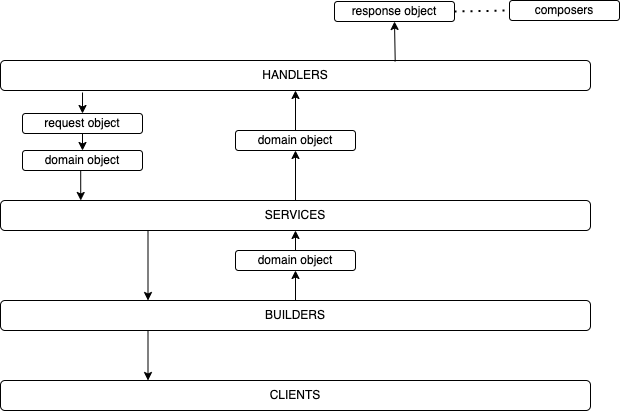

# TechX Portal

### Code Architecture

## Prerequisites
* Golang (1.22.3)

### Install on macosx
[Docker](https://docs.docker.com/docker-for-mac/install/)

Golang: `brew install go`

Ensure `$GOPATH/bin` is in `$PATH`

## Clone repo

`git clone https://github.com/techxclub/portal.git`

## Dev Setup
* Run `make copy-config` to create a local config file
* Run `make db-reset` to setup db
* Run `make run-local` to start the service on port 3000

## Testing

* Run `make test` to run all tests
* Run `make test-coverage` to generate test coverage
* Run `make test-coverage-html` to generate test coverage, and open the results in html format
* Run `bin/happy-path` to simulate happy path on integration

## Generating Mocks
* Run `make generate-mocks` to generate mocks for all interface

## Before committing changes

* If any configs are changed/added, run `make sample-config` to regenerate sample.application.yml with default values
* Run `make ci` before pushing any new changes, to imitate what happens on CI

## See other make commands
`make help`

## Documentation

* When making an API contract change, make the appropriate request changes in the handler, and regenerate docs with:
  `make generate-swagger`
* To view swagger docs locally:
  `make run-local`, and open [swagger path](http://localhost:8080/swagger/v1) on a browser
